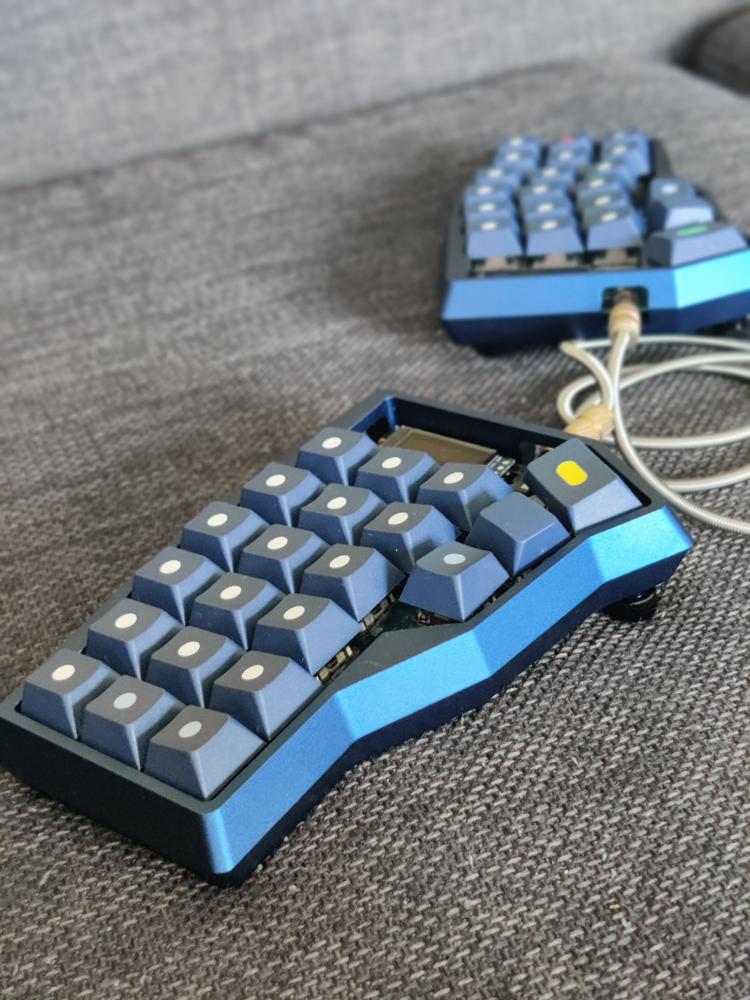
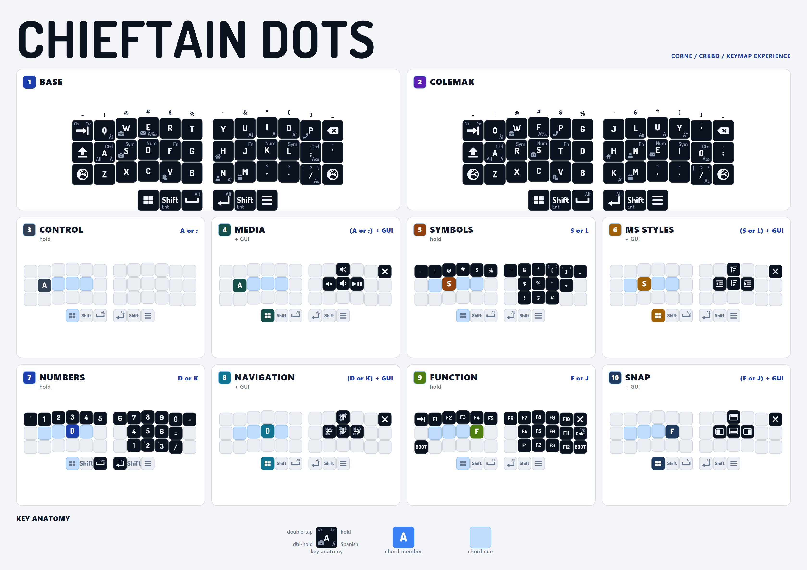

# ChieftainDots Userspace

ChieftainDots is Ricardo Escalon's personal QMK userspace for a Corne keyboard.
The active build target is:

```bash
qmk compile users/eldestroyer74/keymaps/corne.json
```

The current source of truth is this personal userspace repository, not upstream
`qmk/qmk_firmware`. The surrounding QMK checkout is a build dependency.



## Printable Layout



The rendered guide is generated from userspace tooling and is meant as the
quick visual entry point for the current Corne layout. The detailed desk-side
map lives in [the printable layer guide](docs/chieftainDots-printable-layer-guide.md).

## Current State

- Primary keyboard: Corne / `crkbd/rev1`.
- Primary recipe: `keymaps/corne.json`.
- Primary layout wrapper: `LAYOUT_crkbd_w`.
- Port target under trial: Boardsource Unicorne / `boardsource/unicorne`.
- Port recipe: `keymaps/unicorne.json`.
- Port layout wrapper: `LAYOUT_unicorne_w`.
- Active layer model: Base/Colemak typing layers plus a local four-anchor
  trial: A/; = Control, S/L = Symbols, D/K = Numbers, F/J = Function. Each
  anchor has one GUI child layer: Media, MS Styles, Navigation, and Snap. RGB is
  state feedback, and OLED is kept for future review.
- Removed inherited support: stale Cradio and Technik recipes, stale layout
  converters, the old mixed Function layer, Mouse layer, and compiled legacy
  `TH_*` clipboard helpers.

## Daily Docs

- For a new session or handoff, read this README first, then start from
  **Current Focus** in the roadmap and the Session Resume Protocol in the change
  workflow.
- [Printable layer guide](docs/chieftainDots-printable-layer-guide.md):
  desk-side map for normal use.
- [Architecture](docs/chieftainDots-architecture.md): current layer model,
  ownership boundaries, RGB scope, and future keyboard porting model.
- [Engineering guide](docs/chieftainDots-engineering-guide.md): QMK build
  rules, compatibility notes, firmware size pressure, and OLED lessons.
- [Change workflow](docs/chieftainDots-change-workflow.md): how to research,
  edit, compile, flash, stage, and protect private data.
- [Roadmap](docs/chieftainDots-roadmap.md): active backlog, maintainability
  priorities, live trials, and historical decisions.
- [Keymap principles](keymap-principles.md): design principles behind the
  keyboard.

## Build And Flash

Ask before compiling or flashing. Only one QMK build should run at a time.

Canonical compile:

```bash
qmk compile users/eldestroyer74/keymaps/corne.json
```

Boardsource Unicorne compile:

```bash
qmk compile users/eldestroyer74/keymaps/unicorne.json
```

Canonical split flash commands:

```bash
qmk flash users/eldestroyer74/keymaps/corne.json -bl dfu-split-left
qmk flash users/eldestroyer74/keymaps/corne.json -bl dfu-split-right
```

Flash each half with USB plugged directly into that half so QMK writes the
correct `EE_HANDS` marker.

The Boardsource Unicorne target produces a `.uf2` file. Do not flash it until
the Unicorne bootloader process and physical OLED/RGB behavior have been
confirmed.

## Current Feature Shape

- `layout.h` owns layer placement, aliases, and home-row wrappers.
- `eldestroyer74.c` coordinates userspace callbacks, timing behavior, Caps
  Unlock, OLED tap timing, and text snippet dispatch.
- `features/` owns Tap Dance punctuation ladders, text snippets, Caps Unlock,
  disabled combo scaffolding, and future reusable behaviors.
- `rgb/` owns state-feedback lighting.
- `oled/` owns display rendering and animation.

The active Corne build uses more than eight layers, so `config.h` uses
`LAYER_STATE_16BIT`.

## Private Data

Committed text snippets are placeholders. Local-only private values belong in:

```text
features/text_stubs_private.h
```

That file is ignored by Git. Before staging or committing text-snippet work,
check that private addresses, private URLs, passwords, and recovery keys are not
in staged diffs.

## Future Keyboard Ports

Future keyboards, such as Mountain Ergo or Draculad, should start from the
current ChieftainDots layer model with a fresh JSON recipe and wrapper. Do not
restore old Filterpaper Cradio or Technik recipes unchanged; those described a
different layer model.

The architecture doc has the current porting checklist and example recipe shape.

## Ancestry

This userspace began from Filterpaper's QMK userspace and still keeps some
archived inherited code for reference. Treat that code as history and reference
material, not active ChieftainDots guidance.

Old wrapper ideas should be recovered from Git history or the intended
`filterpaper-layout-wrappers-20260515` preservation tag after the Git source of
truth is reconciled.

## Useful Links

- [QMK Firmware](https://github.com/qmk/qmk_firmware)
- [QMK userspace docs](https://docs.qmk.fm/#/feature_userspace)
- [External userspace docs](https://docs.qmk.fm/#/newbs_external_userspace)
- [QMK Toolbox](https://github.com/qmk/qmk_toolbox)
- [Pascal Getreuer's keyboard posts](https://getreuer.info/posts/keyboards/)
